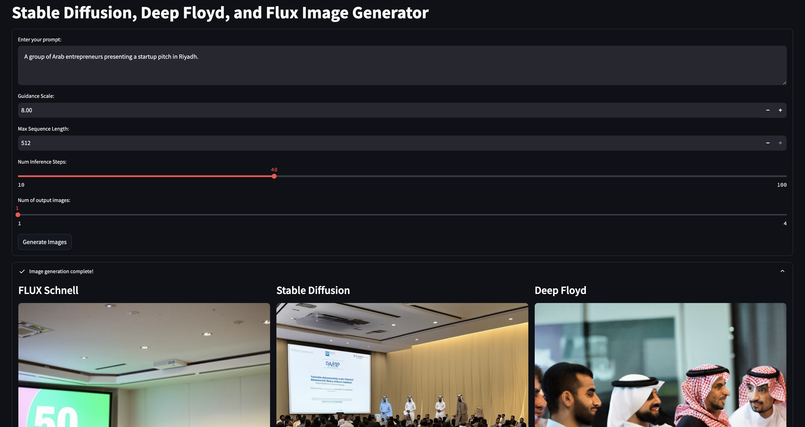

### **Image Generation Interface**  

This project provides an interface for running **three image generation models**:  
- **Stable Diffusion 3.5 Medium** *(by Stability AI)*  
- **Deep Floyd IF** *(by DeepFloyd)*  
- **FLUX Schnell** *(by Black Forest Labs)*  

It allows users to generate **high-quality images** based on prompts, with a focus on comparing results from different models.  

---

### **🖥️ How to Run**  
Make sure you have all dependencies installed, then run:  
```bash
streamlit run app.py
```

---

### **📸 Example Output**  
 
 

---

### **📂 Project Structure**  
```
/models
│── stable_diffusion.py
│── deep_floyd.py
│── flux_schnell.py
app.py  # Main Streamlit app
requirements.txt
```

---